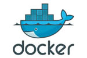

# A Docker Cheat Sheet

* introducing:
    * What is Docker?
    * What is a container platform?
    * Want to improve this cheat sheet?
*
* General:
    * [Contributing](#contributing)
    * [Insperation](#insperation)
    * [References](#references)
    * [License](#license)


### What is Docker?
>[Docker](https://www.docker.com/what-docker) is the company driving the container movement and the only container platform provider to address every application across the hybrid cloud.

### What is a container platform?
>A [container platform](https://www.docker.com/what-docker) is a complete solution that allows organizations to solve multiple problems across a diverse set of requirements.

### Want to improve this cheat sheet?
> See the  [Contributing](#contributing) section!

## Purging All Unused [Images, Containers, Volumes, and Networks]:

Docker provides a single command that will clean up any resources — images, containers, volumes, and networks — that are dangling (not associated with a container):

```
docker system prune
```

To additionally remove any stopped containers and all unused images (not just dangling images), add the -a flag to the command:

```
docker system prune -a
```

## Removing Docker Images:

### Remove one or more specific images:

Use the `docker images` command with the `-a` flag to locate the ID of the images you want to remove. This will show you every image, including intermediate image layers. When you've located the images you want to delete, you can pass their ID or tag to `docker rmi`:

List:
```
docker images -a
```
Remove:
```
docker rmi IMAGE [IMAGE...]
```

### Remove dangling images:
Docker images consist of multiple layers. Dangling images are layers that have no relationship to any tagged images. They no longer serve a purpose and consume disk space. They can be located by adding the filter flag, `-f` with a value of `dangling=true` to the `docker images` command. When you're sure you want to delete them, you can use the `docker images purge` command:
> Note: If you build an image without tagging it, the image will appear on the list of dangling images because it has no association with a tagged image. You can avoid this situation by [providing a tag](https://docs.docker.com/engine/reference/commandline/build/#/tag-image--t) when you build, and you can retroactively tag an images with the [docker tag](https://docs.docker.com/engine/reference/commandline/tag/) command.

List:
```
docker images -f dangling=true
```
Remove:
```
docker images purge
```
### Removing images according to a pattern:
You can find all the images that match a pattern using a combination of `docker images` and `grep`. Once you're satisfied, you can delete them by using `awk` to pass the IDs to `docker rmi`. Note that these utilities are not supplied by Docker and are not necessarily available on all systems:

List:
```
docker images -a |  grep "pattern"
```
Remove:
```
docker images -a | grep "pattern" | awk '{print $3}' | xargs docker rmi
```

### Remove all images:
All the Docker images on a system can be listed by adding `-a` to the `docker images` command. Once you're sure you want to delete them all, you can add the `-q` flag to pass the Image ID to `docker rmi`:

List:
```
docker images -a
```
Remove:
```
docker rmi $(docker images -a -q)
```

## Removing Containers:

### Remove one or more specific containers:


## Insperation:

## References:
* [digitalocean](https://www.digitalocean.com/community/tutorials/how-to-remove-docker-images-containers-and-volumes)
* 

## License:
# A Docker Cheat Sheet


## Purging All Unused [Images, Containers, Volumes, and Networks]:

Docker provides a single command that will clean up any resources — images, containers, volumes, and networks — that are dangling (not associated with a container):

```
docker system prune
```

To additionally remove any stopped containers and all unused images (not just dangling images), add the -a flag to the command:

```
docker system prune -a
```

## Removing Docker Images:

### Remove one or more specific images:

Use the `docker images` command with the `-a` flag to locate the ID of the images you want to remove. This will show you every image, including intermediate image layers. When you've located the images you want to delete, you can pass their ID or tag to `docker rmi`:

List:
```
docker images -a
```
Remove:
```
docker rmi IMAGE [IMAGE...]
```

### Remove dangling images:
Docker images consist of multiple layers. Dangling images are layers that have no relationship to any tagged images. They no longer serve a purpose and consume disk space. They can be located by adding the filter flag, `-f` with a value of `dangling=true` to the `docker images` command. When you're sure you want to delete them, you can use the `docker images purge` command:
> Note: If you build an image without tagging it, the image will appear on the list of dangling images because it has no association with a tagged image. You can avoid this situation by [providing a tag](https://docs.docker.com/engine/reference/commandline/build/#/tag-image--t) when you build, and you can retroactively tag an images with the [docker tag](https://docs.docker.com/engine/reference/commandline/tag/) command.

List:
```
docker images -f dangling=true
```
Remove:
```
docker images purge
```
### Removing images according to a pattern:
You can find all the images that match a pattern using a combination of `docker images` and `grep`. Once you're satisfied, you can delete them by using `awk` to pass the IDs to `docker rmi`. Note that these utilities are not supplied by Docker and are not necessarily available on all systems:

List:
```
docker images -a |  grep "pattern"
```
Remove:
```
docker images -a | grep "pattern" | awk '{print $3}' | xargs docker rmi
```

### Remove all images:
All the Docker images on a system can be listed by adding `-a` to the `docker images` command. Once you're sure you want to delete them all, you can add the `-q` flag to pass the Image ID to `docker rmi`:

List:
```
docker images -a
```
Remove:
```
docker rmi $(docker images -a -q)
```

## Removing Containers:

### Remove one or more specific containers:


## <a name="contributing">Contributing</a>

## <a name="insperation">Insperation</a>
> In the last year, we had different projects in complex environments and changing frequently. 
While the deployment was on cloud-based platforms such as Google Cloud and Amazon AWS, the developers had to use a Mac, Linux and Windows platform.
>
> We had to switch between development in the office, to implementation at the client site from Migration of enterprise applications, web development, e-commerce, and a lot of python scripting.
>
>Docker helped us to keep focusing on the tasks while the system deployment handled through a script.
>
> We search for countless places to find the right document to maintain each project. 
>
>This repository is a result of those projects. With samples and step by step examples.


## <a name="references">References</a>
* [digitalocean](https://www.digitalocean.com/community/tutorials/how-to-remove-docker-images-containers-and-volumes)
* https://github.com/juliogomez/docker_cheatsheet
* https://github.com/wsargent/docker-cheat-sheet/blob/master/README.md
* https://github.com/tchapi/markdown-cheatsheet
* https://github.com/dennyzhang/cheatsheet-docker-A4
* https://github.com/daten-und-bass/docker-cheat-sheet 
* https://github.com/daten-und-bass/docker-cheat-sheet

## Further information:
Reference documentation: https://docs.docker.com/reference/

## <a name="license">License</a>


@ShmuelMaruani, @LimitlessVirtue, @limitlessv